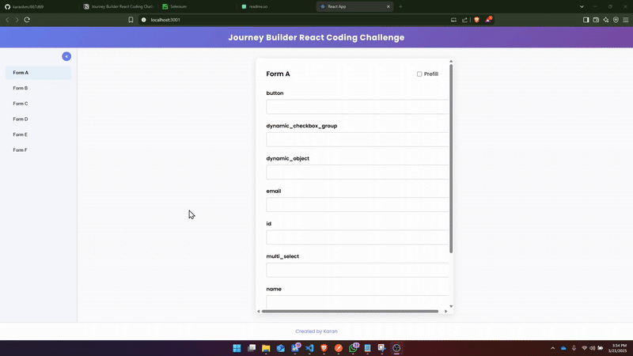

# React Coding Challenge Submission

What does this app do ?

- Fetches a DAG of forms from a mock server (frontendserver)
- Renders a collapsible sidebar for navigation  
- Shows one form at a time with “Prefill” support  
- Lets you map fields from upstream forms or global values 

## Table of Contents

1. [Getting Started](#getting-started)
2. [Key Patterns](#key-patterns)
3. [Using Custom Data](#how-to-use-different-data)
4. [Demo](#demo)
5. [DAG of Forms](#dag-of-the-forms)
6. [Key Patterns](#key-patterns)
7. [Using custom data](#how-to-use-different-data)
8. [Tests](#tests)

## Getting Started
### Prereqs


- Node.js ≥ 14  
- npm or yarn 

### Installation

```bash
# clone the repo
git clone https://github.com/karanlvm/667d69.git
cd 667d69
cd app

# install dependencies
npm install
```

### Running Locally

1. Start the mock server

```bash
# Navigate to the frontendserver folder
cd frontendserver
npm start
```

2. Run the React App:

```bash
# Navigate to the app folder
cd app
npm start
```

NOTE: Port 3000 will be taken up by the mockserver so React will ask you if it can use another available port and will give you the address in terminal.

## Demo


## DAG of the forms
Since we have another form F, I used the same DAG from the problem statement but with just one minor modification for Form F


## Key Patterns

1. Each component owns its markup, logic and for some components its own CSS file.

2. Form values, mappings, and toggle flags live in top-level state in `App.tsx` and flow down.

3. `getUpstreamNodeIds(nodeId, edges)` extracts exactly the forms you can prefill from. So there is no hard coding.

4. All the fields in the forms come from the `field_schema.properties`.

5. All the animations for this project was done using framer-motion.

## How to use different data
- This app currently uses hard-coded global valyes
- Upstream form fields

To add a new source
1. Define a new source key in `GLOBAL_VALUES` or a new constant.

2. Inject it into the modal’s `allOptions` array by augmenting the `modalOptions` in App.tsx:
```bash
const extraSource: Option[] = fetchedUserProfileFields.map(field => ({
  key: `PROFILE.${field.key}`,
  label: `Profile.${field.label}`,
  sourceFormId: "PROFILE",
  sourceField: field.key,
}));

const modalOptions = [
  ...extraSource,
  ...upstreamModalOptions
];
```
3. You will also need to handle the new source in `getInputValue`:
```bash
function getInputValue(field: string) {
  const map = mappings[currentNode.id]?.[field];
  if (map.sourceFormId === "PROFILE") {
    return userProfileData[map.sourceField];
  }
  // existing logic
}
```
Because we treat all sources uniformly via the Option interface, adding future sources only requires updating in two parts.

## Tests

I have used Jest for running the Unit tests. All the test files for the components can be found under the 'tests' folder

### Running the tests

To run the tests. You can use

```bash
npm test
```

### What were the test cases?

1. Sidebar (3 cases)
    - Renders form names and highlights the active one
    - Calls onSelect callback with correct id when a form is clicked
    - Calls toggle callback when the collapse button is clicked

2. FormCard (5 cases)
    - Renders 'email' and 'notes' fields and disabled 'Submit' button.
    - Enables button to 'Next' when nextDisabled=false and calls onNext
    - Toggles Prefill checkbox, calls onTogglePrefill, updates isPrefilled and sourceLabel on FieldRows with mapping
    - Renders Submit vs Next correctly, and onNext callback on button click
    - Propagates FieldRow events: onChange via click, onClear/onConfigure via clear button and input click

3. PrefillModal (4 cases)
    - Does not render when isOpen = false
    - Renders header, search input, and group labels for global/upstream options
    - Toggles a group open, selects a global option, enables 'Select' button, calls onSelect with correct Option
    - Clicking 'Cancel' calls onClose

4. FieldRow (2 cases)
    - Non-prefilled state: label visible, input editable with given value, no clear button, placeholder emphasis, onChange fires correctly
    - Prefilled state: input read-only, clicking input triggers onConfigure, clear button present and fires onClear, sourceLabel button triggers onConfigure


### Test Results


## Author
[Karan Vasudevamurthy]("https://karanlvm.info")